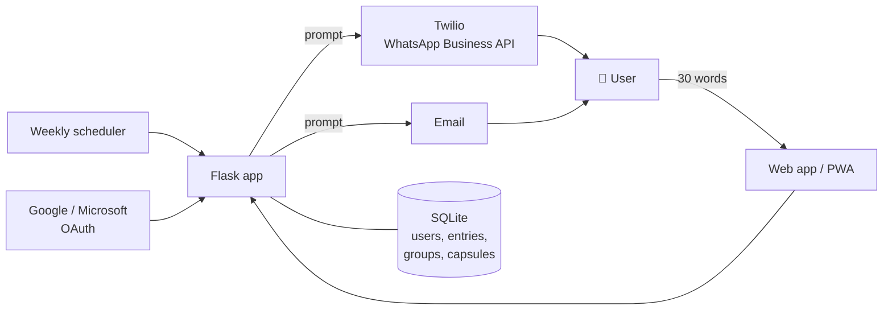

# ✍️ Brief

**Thirty words about your life, right now. Every week. A quiet personal record of how you change over time.**

🔗 **Live:** [www.my30words.com](https://www.my30words.com)
🔒 *Source code is private. I'm happy to walk through it in an interview.*

> *"Your time matters. Your words matter."*

---

## The idea

Journaling apps ask for too much, so people stop. Brief asks for **thirty words a week, no more**: a snapshot of what is actually true right now. Over months and years those snapshots add up to something rare, a way to scroll back and meet the version of yourself from two years ago.

## How it works

1. **Write:** each week you get a single prompt and answer it in 30 words
2. **Return:** your entry is quietly archived
3. **Remember:** scroll back through your own timeline and see how you have changed

Prompts arrive by **WhatsApp or email**, so the habit reaches people where they already are.

## Features

- 🗓️ **A 16-week prompt cycle** built around four "anchor" questions (how things really are, what you would protect, the question you are living with, what you hope is remembered). These return each cycle so you can compare yourself year on year. Twelve lighter "texture" prompts fill the weeks in between.
- 👥 **Groups:** share entries with a small circle and watch each other change
- 🌊 **Echoes:** an opt-in, anonymous public feed of real entries
- ⏳ **Time capsules:** seal an entry for 1, 5 or 10 years
- 📱 **Installable web app (PWA)**, with Google, Microsoft or email sign-in

## Private by default

- Nothing is public unless the user chooses it
- **Export your full history** as a text file at any time
- **Delete your account and every word disappears permanently**, with no hidden backup
- Email is used only for login and password reset

## Architecture

## Tech stack

| Area | Technologies |
|---|---|
| Backend | Python, Flask, scheduled jobs |
| Data | SQLite |
| Messaging | Twilio, WhatsApp Business API (Meta-approved message templates), email |
| Identity | Google OAuth, Microsoft OAuth (Azure app registration), email/password |
| Front end | HTML, CSS, JavaScript, Progressive Web App |
| Infrastructure | PythonAnywhere, Cloudflare DNS, GitHub |

## Problems I solved along the way

**⏱️ Prompts drifting off schedule.** Some users received prompts on an 8-day cycle instead of 7, and for others the prompt cycle stalled. Both bugs came from tracking each user's week position as a stored counter that could fall out of step. I rebuilt it so the week is **calculated purely from time** (from sign-up to now), so the schedule can no longer drift, and I back-filled existing users with a one-off migration.

**🔐 A credential-exposure incident, handled properly.** While moving the project to GitHub, an automated secret scanner flagged API credentials in an early commit. I **rotated every exposed secret** (Google, Microsoft and Twilio) so the leaked values were dead, rebuilt the Git history as a single clean commit, and locked the repository down with a strict `.gitignore` for databases, configuration and backups. The lesson I took away and now apply to every project: if a first commit ever contained a secret, reset the history rather than just untracking the file.

**📲 From sandbox to production WhatsApp.** I moved from Twilio's test sandbox to a production WhatsApp sender. That meant Meta business verification, an approved message template for prompts sent outside the 24-hour conversation window, and a four-step onboarding flow so users give clear consent.

**🔒 HTTPS that wouldn't validate.** Certificate issuance failed because of the registrar's DNS setup. Moving DNS to Cloudflare, with the records set to DNS-only, fixed it. I later reused the same fix on another project.

## What this project demonstrates

- **Product thinking:** a deliberately small ask (30 words) designed around how habits actually form
- **Reliable scheduled systems** and debugging subtle time-based bugs
- **Real-world messaging integration** within WhatsApp's consent and template rules
- **Security maturity:** a transparent incident response, and privacy-first data handling with full export and permanent deletion

---

*Built by [Barry Sisk](https://github.com/BBSISK) · Higher Diploma in Software Development, Maynooth University*
